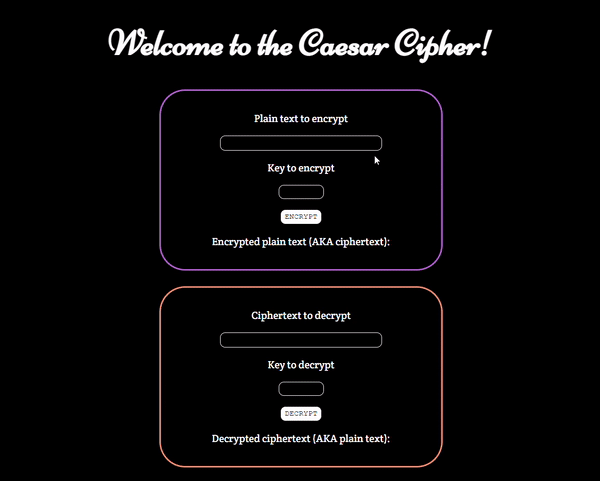

# Caesar Cipher
This Caesar Cipher was built in JavaScript during Execute Big's Tech Roulette Week 8. 
- Learned about the basics of encryption and decryption
- Practiced using the Caesar Cipher to encrypt and decrypt messages

## Website: https://jbian92.github.io/Caesar-Cipher/ 

